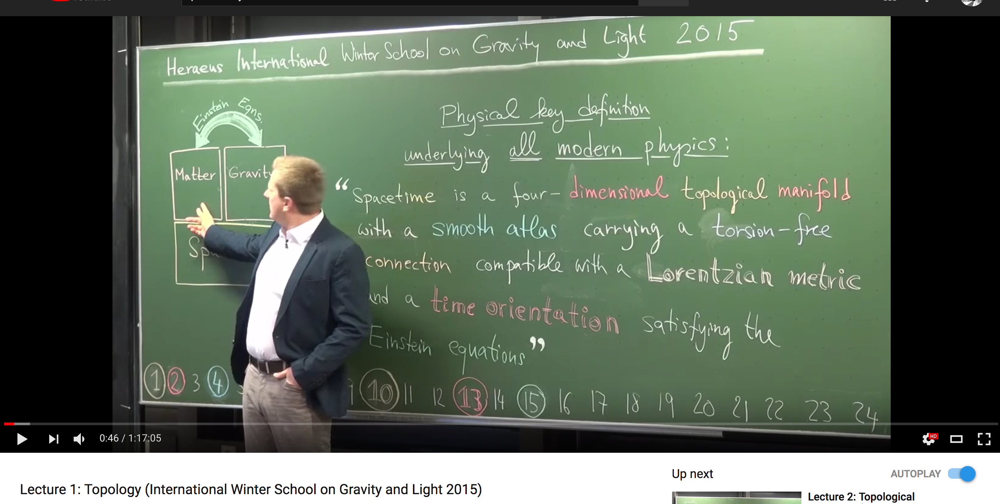

# Contents
   - [Reading List](#reading-list-differential-geometry) 
   - [Research Paper](#research-papers) 

# Reading list Differential Geometry
Here is a list of courses/books one can use. This list is presented in no particular order of reading, but in a order I feel easier to understand. 
To begin with  
* The most important book is [Differential Geometry of Curves and Surfaces by Manfredo doCarmo](http://www.math.uni.lodz.pl/~maczar/ggk/do%20Carmo,%20Differential%20Geometry%20of%20Curves%20and%20Surfaces.pdf). 
* Associated lecture by [Claudio Arezzo at ICTP](https://www.youtube.com/watch?v=tKnBj7B2PSg&list=PLLq_gUfXAnkl5JArcktbOrIUeR5rra-Gz). The lectures go through the chapters of the book and make the reading so much easier.  

* Gravity and Light: A differential geometery course with a taste of physics, spacetime and gravitation. [video lectures](https://www.youtube.com/watch?v=7G4SqIboeig&list=PLMsYJgjgZE8hh6d6ia2dP1NI0BKNRXbiw&index=1&t=409s) [tutorials](https://gravity-and-light.herokuapp.com/tutorials)  
Not to scare anyone, but this is the first lecture's first minute. It is so amazing. 

* Differential Geometry for *Computer Science* by [Justin Solomon](https://www.youtube.com/user/justinmsolomon/videos?sort=dd&view=0&shelf_id=1)

## Primary Reference Books
* Shapes and Diffeomorphisms by Laurent Younes. [link](https://link.springer.com/book/10.1007%2F978-3-642-12055-8)
* Differential Geometry: Curves, Surfaces and Manifold by Wolfgang Kuhnel. 
* Introduction to Smooth Manifolds by John M Lee. 

## Other reference books
* Numerical Geometry of Rigid Shapes by Alex Bronstein, Michael Bronstein and Ron Kimmel.
* Gravitation by Charles W. Misner, John Archibald Wheeler, and Kip Thorne
* A panaromic view of Riemannian Geometry by Marcel Berger. [link](http://www.springer.com/us/book/9783540653172)
* Calculus on Manifolds by Michael Spivak.
* Spacetime and Geometry: An Introduction to General Relativity by Sean Carroll.
* Statistical Shape and deformations by Guoyan Zheng, Shuo Li, Gabor Szekely [link](https://www.elsevier.com/books/statistical-shape-and-deformation-analysis/zheng/978-0-12-810493-4) A statistical shape analysis book with more focus on medical imaging.

### Quick Glossary
At times, I get lost with certain definitions which has roots in Group Theory. One might encounter Lie Groups and notions of Symmetry  sooner or later while going through these material. Instead of going diiging into Abstract Algebra books. Here is a good quick reference material explained on this [page](http://www.jmilne.org/math/CourseNotes/index.html)
Also you can refer to this [short definitions](https://www.youtube.com/playlist?list=PLi01XoE8jYoi3SgnnGorR_XOW3IcK-TP6)

### Other reference YouTube Channels 
In my opinion, someone interested in geometry should also have a keen interest in physics with emphasis on classical mechanics, Einstein's relativity. It makes the reading much easier as it helps one to visualize the concepts. In that spirit some of the popular science books in no particular order are:  
* **The Road to Reality by Roger Penrose:** [link](https://www.amazon.com/Road-Reality-Complete-Universe-Paperback/dp/B010WEZEDG/ref=sr_1_3?ie=UTF8&qid=1516390192&sr=8-3&keywords=the+road+to+reality) This is an amazing book if you have the time to go through it. It is huge over a 1000 pages. The reason it is such an important book is because it takes you on a chronological journey of mathematics. Understanding the limitations of available mathematical tools will help one to appreciate the efforts made in discovering new tools. 
* **Special Relativity and Classical Field Theory: The Theoretical Minimum:** [link](https://www.amazon.com/Special-Relativity-Classical-Field-Theory/dp/0465093345/ref=sr_1_3?s=books&ie=UTF8&qid=1516390740&sr=1-3&keywords=leonard+susskind) This is a book which I still have to read but it follows the lectures of Prof. Leonard Susskind and the amazing website [The Theoretical Minimum](http://theoreticalminimum.com/)
* **Topology and Geometry:** An amazing lecture series by Prof. Tadashi Tokieda on [YouTube](https://www.youtube.com/watch?v=SXHHvoaSctc&list=PLTBqohhFNBE_09L0i-lf3fYXF5woAbrzJ)
* **3Blue1Brown:** An amazing YouTube channel discussing Topology and visualizations. [Here is the link](https://www.youtube.com/channel/UCYO_jab_esuFRV4b17AJtAw)
* **Mathematical Methods and its Applications:** If you get stuck on some small mathematical notion which we always do at times. Here is a lecture series which can help [link](https://www.youtube.com/watch?v=7Q2BsWzjVvM&list=PLq-Gm0yRYwTizdeCch3lvaq-DWTh1Nfo2)

### Some other books and media of interest:
* **Fermat's Last Theorem - The Theorem and Its Proof: An Exploration of Issues and Ideas**: An amazin 1993 documentry about Andrew Wiles and his struggles with Fermat's Last Theorem. Here is the [movie](https://www.youtube.com/watch?v=6ymTZEeTjI8&t=10s)
* **Logicomix: An epic search for truth** by Christos Papadimitriou: An amazing *comic-like* book about the historical context and discussions between Cantor, Russel and Wittgenstein.
* **A Mathematician's Apology** by GH Hardy: A letter written by Hardy towards the end of his career and his reflections on his mathematical career. Here is the [letter](https://www.math.ualberta.ca/mss/misc/A%20Mathematician%27s%20Apology.pdf).

# Research Papers
I am working on it and will be updated soon with key research articles focussed on medical imaging. 
* [Topology TooKit](http://www-pequan.lip6.fr/~tierny/) by Julien Tierny and the associated book [Topological Data analysis for scientific viualization](https://link.springer.com/book/10.1007%2F978-3-319-71507-0)
